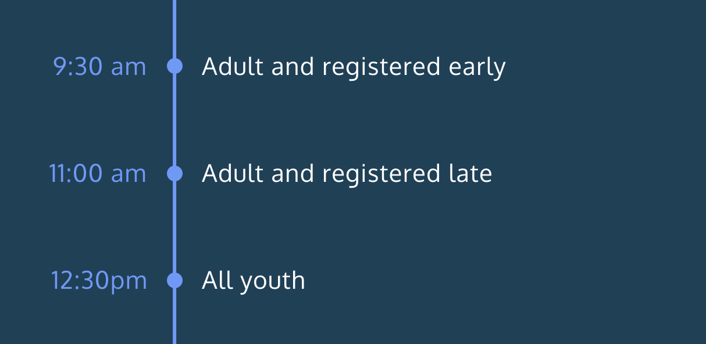

# Race Day Event Registration System
My answer to CodeAcademy's - Learn JavaScript - Raceday project

---

Welcome to the Race Day Event Registration System! This simple web application simulates a race event registration process where participants can input their age and registration status to receive information about their race details.

## Table of Contents

- [Overview](#overview)
- [Features](#features)
- [Usage](#usage)
- [Getting Started](#getting-started)
- [Contributing](#contributing)
- [License](#license)
- [Acknowledgements](#acknowledgements)

## Overview

The Race Day Event Registration System is built using HTML, CSS, and JavaScript. It allows participants to register for the race, and based on their age and registration status, provides them with specific race details such as the race time and race number.

## Features

- User-friendly registration form.
- Conditional statements to determine race details.
- Randomized race numbers for participants.
- Responsive design for various screen sizes.

## Usage

1. Open the `index.html` file in your web browser.
2. Enter your age and select the registration status (early or late).
3. Click the "Register" button to see your race details displayed on the page.

## Getting Started

To run the Race Day Event Registration System on your local machine, follow these steps:

1. Clone this repository to your computer.
2. Open the `index.html` file in your web browser.
3. Enter your information in the registration form and click "Register."

## Contributing

Contributions are welcome! If you have any suggestions, improvements, or bug fixes, please feel free to submit a pull request or open an issue.

## License

This project is licensed under the [MIT License](LICENSE).

## Acknowledgements

This project was inspired by the "Race Day Event Registration System" project from Codecademy's [Learn JavaScript](https://www.codecademy.com/learn/introduction-to-javascript) course. The concept and initial code structure were adapted from the course's project, with additional modifications and improvements made by Hollis-Brown.

Please note that the original concept and code structure are attributed to Codecademy.

---

Project created by Hollis-Brown
